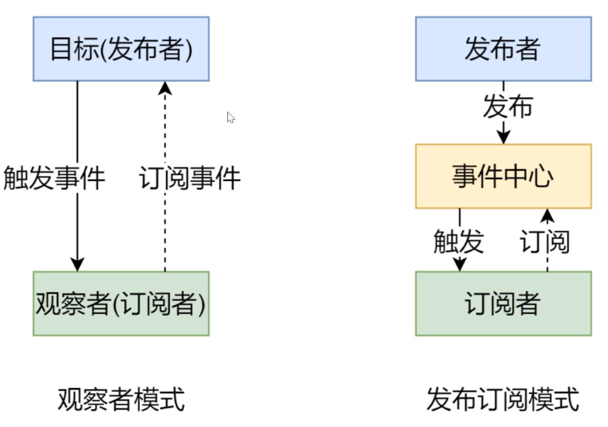
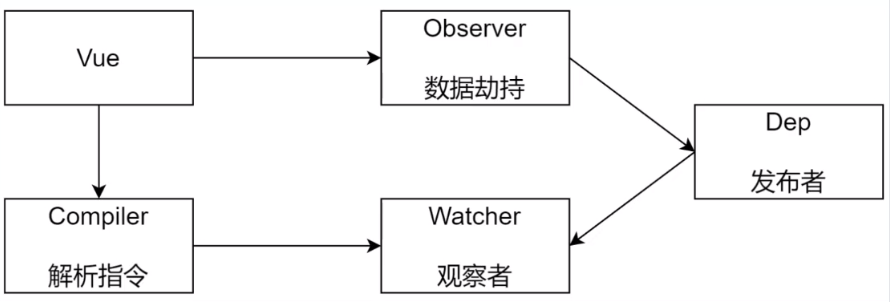

## VUE 响应式原理

### 数据响应式原理

Vue 2.x

> 当你把一个普通的 JavaScript 对象传入 Vue 实例作为 data 选项，Vue 将遍历此对象所有的 property，并使用 Object.defineProperty 把这些 property 全部转为 getter/setter。Object.defineProperty 是 ES5 中一个无法 shim 的特性，这也就是 Vue 不支持 IE8 以及更低版本浏览器的原因。

defineProperty 代码示例，详见 [defineProty示例](./test/defineproperty.html)

``` javascript
let data = {
    msg: 'hello'
}

// 数据劫持
Object.defineProperty(data, 'msg', {
    // 可枚举
    enumerable: true,
    // 可配置(可以使用delete删除)
    configurable: true,

    get() {
        // 需要用一个新的字段保存实际的msg值，因为在get中如果访问msg会导致重复触发getter
        console.log('get:', data._msg);
        return data._msg;
    },

    set(newValue) {
        console.log('set:', newValue);
        if (newValue === data._msg) {
            return;
        }
        data._msg = newValue;

        document.querySelector('#app').textContent = data._msg;
    }

})

// 测试
data.msg = 'hello world';
console.log(data.msg);
```

Vue 3.x

Proxy 代码示例， 详见 [Proxy示例](./test/proxy.html)

``` javascript
let data = {
    msg: 'hello',
    count: 0,
}

let vm = new Proxy(data, {
    get (target, key) {
        console.log('get, key: ', key, target[key]);
        return target[key];
    },
    set(target, key, newValue) {
        console.log('set, key:', key, newValue);
        if (target[key] === newValue) {
            return;
        }
        target[key] = newValue;
        document.querySelector('#app').textContent = target[key];
    }
})

// test
vm.msg = 'along';

vm.count = 20;
```

### 发布订阅模式 与 观察者模式

发布订阅模式

vue和node事件基于发布订阅模式

vue 自定义事件示例,实现兄弟组件间的通讯

``` javascript
// eventBus.js 事件中心
let eventBus = new Vue();

// 注册两个事件，A、B 在created生命周期中注册两个订阅者，C 发布事件

// A,vue 
created() {
    eventBus.$on('datachange', () => {
        console.log('datachange, then 1');
    })
}

// B.vue
created() {
    eventBus.$on('datachange', () => {
        console.log('datachange, then 2')
    })
}

// C.vue
// 触发事件，发布者
methods: {
    onDataChange() {
        eventBus.$emit('datachange', {text: 'along'});
    }
}
```

模拟实现 事件中心 详见 [eventemitter](./test/eventemitter.html)

```javascript
// 事件触发器
class EventEmitter {
    constructor() {
        this.subs = Object.create(null);
    }

    $on(eventType, handler) {
        // 如果没有注册过该事件，设置该事件为空数组
        this.subs[eventType] = this.subs[eventType] || [];
        this.subs[eventType].push(handler);
    }   

    $emit(eventType) {
        if (this.subs[eventType]) {
            this.subs[eventType].forEach(handler => {
                handler(); 
            })
        }
    }
}

// test
let em = new EventEmitter();

em.$on('click', () => {
    console.log('click then 1');
})
em.$on('click', () => {
    console.log('click then 2');
})

em.$emit('click');
```

观察者模式

vue响应式机制使用了观察者模式

观察者模式没有事件中心，只有发布者和订阅者，发布者需要知道订阅者的存在

- 观察者模式中，订阅者称为观察者，Watcher
    - update(), 观察者需要实现update方法，定义事件发生时具体要做的事情
- 发布者，Dep
    - subs: 存储观察者的数组
    - addSub(): 注册添加观察者
    - notify(): 事件发生时，通知所有的观察者update()方法

观察者模式代码示例，详见[](./test/depwatcher.html)

```
// 发布者
class Dep {
    constructor() {
        // 记录所有的订阅者
        this.subs = [];
    }

    addSub(sub) {
        if (sub && sub.update) {
            this.subs.push(sub);
        }
    }

    notify() {
        this.subs.forEach(sub => {
            sub.update();
        })
    }
}

// 订阅者
class Watcher {
    update() {
        console.log('update');
    }
}

// test
let dep = new Dep();
let watcher = new Watcher();

dep.addSub(watcher);

dep.notify();
```

观察者模式和发布订阅模式的区别

- 观察者模式由具体目标调度，当时间触发，Dep就会调用观察者的方法，观察者和发布者之间存在依赖关系
- 发布/订阅模式由事件中心调度，发布者和订阅者不需要知道对方的存在



### vue 响应式原理总览



#### VUE

- 负责接收初始化参数
- 负责把data中的属性注入到Vue中，转换为getter/setter
- 负责调用Observer监听data中属性的变换
- 负责调用Compiler解析指令/差值表达式

类图
|  VUE   | 
|  ----  |
| + \$options <br/> + \$el <br/> + $data|
| - _proxyDate() | 

#### Observer 数据劫持

- 负责把data中的数据转换成响应式数据
- data中的某个属性是对象时，把该对象属性也转换成响应式数据
- 数据变化时发送通知
  
类图
|  Observer   | 
|  ----  |
| + walk() <br/> + defineReactive|

#### Compiler 

- 编译模板，解析指令差值表达式
- 负责页面的首次渲染
- 数据变化时更新视图

类图
|  Compiler   | 
|  ----  |
| + el <br/> + vm|
| + compile(el) <br/> + compilerElement(node) <br/> + compileText(node) <br/> + isDirective(attrName) <br> + isTextNode(node) <br/> + isElementNode(node) |

- compile(el) 解析节点，如果是文本节点，解析差值表达式，如果是元素节点解析指令
- compileElement(node) 解析元素节点
- compileText(node) 解析文本节点
- isDirective(attrName) 判断属性是否是指令

#### Dep(Dependency)

- 收集依赖，添加观察者
- 通知所有观察者更新数据

类图
|  Dep   | 
|  ----  |
| + subs |
| + addSub(sub) <br/> + notify() | 

#### Watcher

- 数据变化时dep通知所有watcher 更新视图
- 自身实例化时 注册到dep 对象中

类图
|  Watcher   | 
|  ----  |
| + vm <br/> + key <br/> + cb <br/> + oldValue |
| + update() | 


